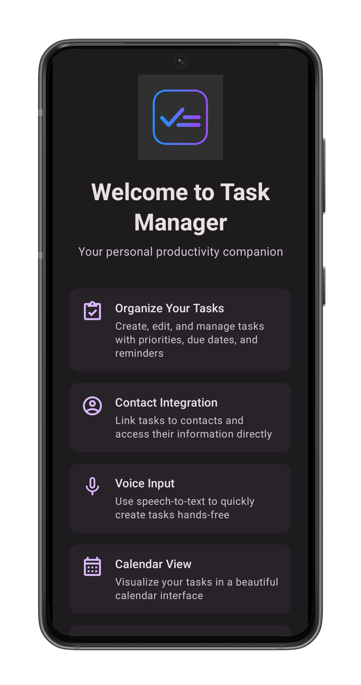
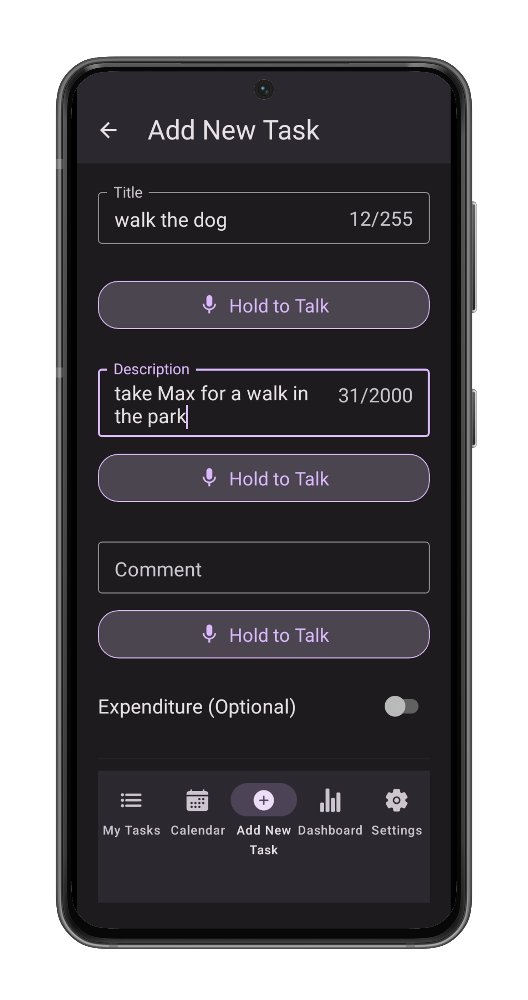
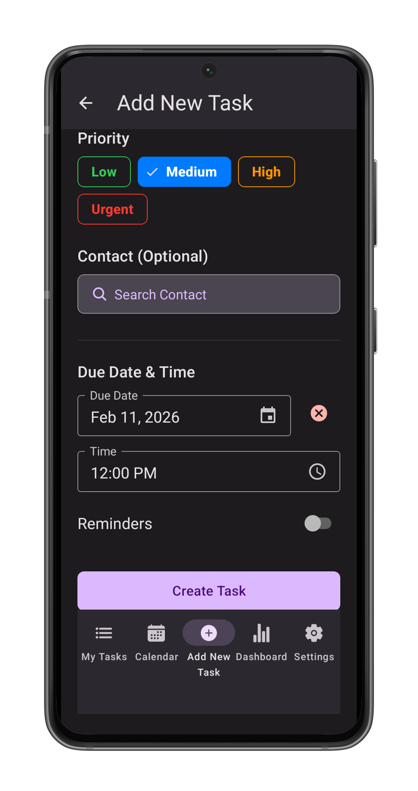
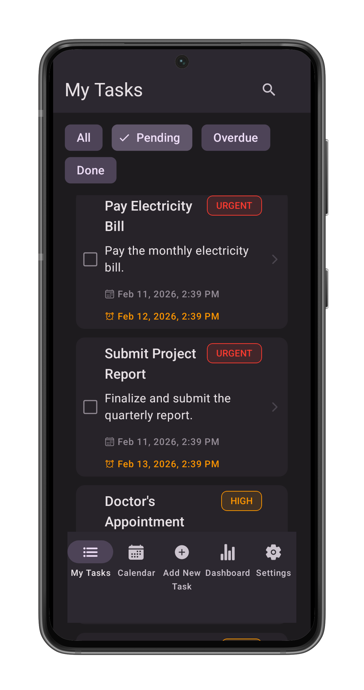
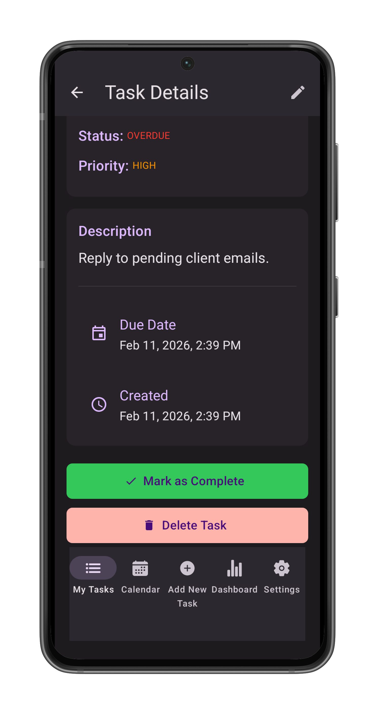
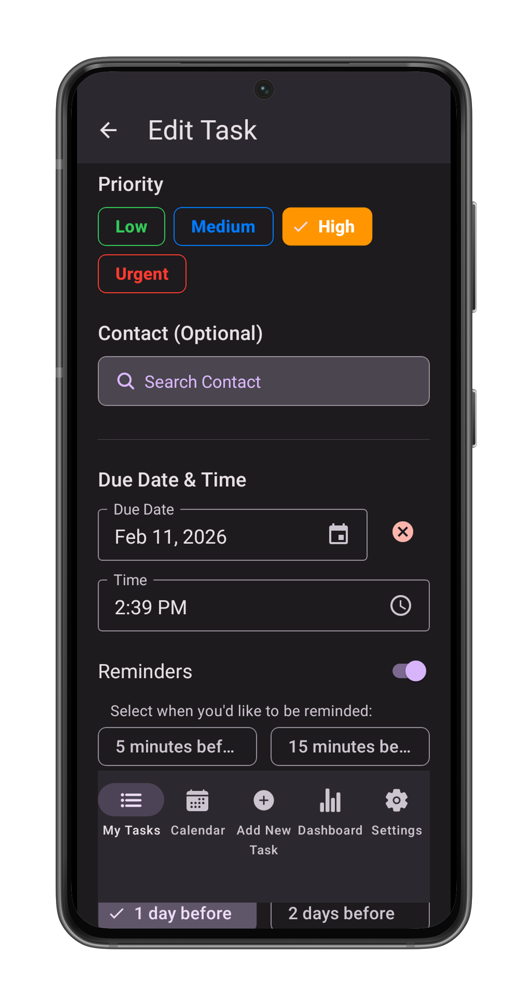
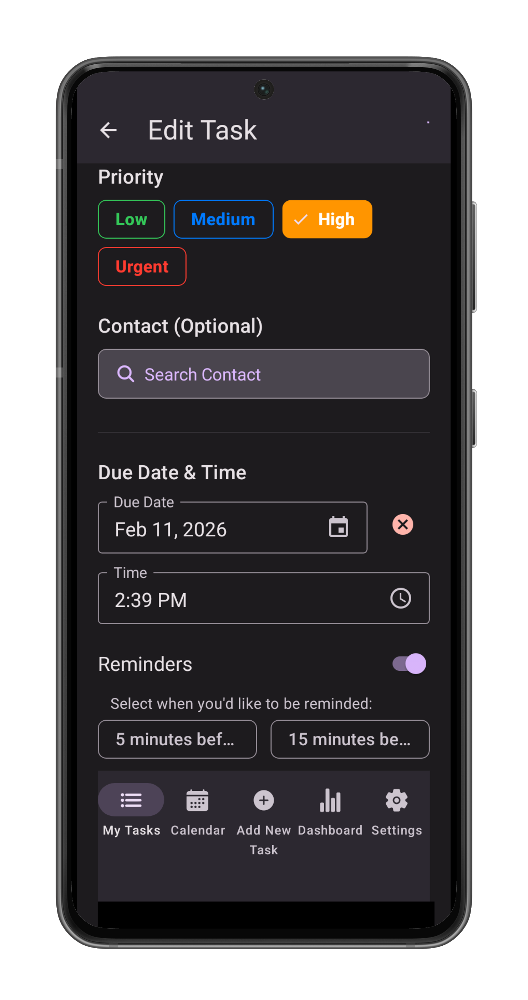
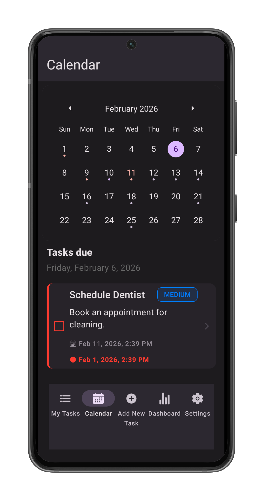
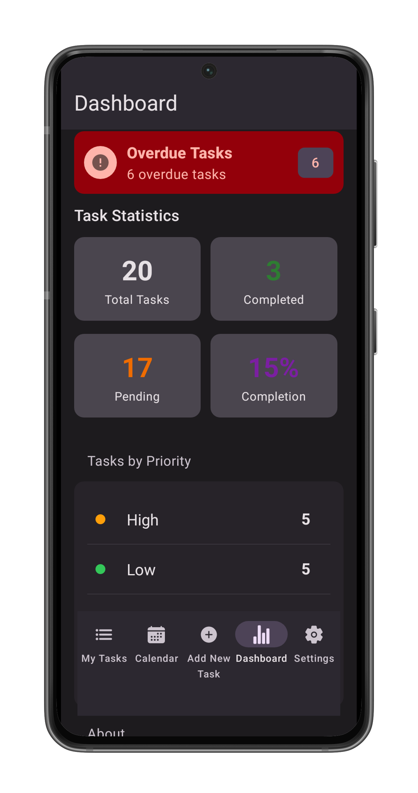
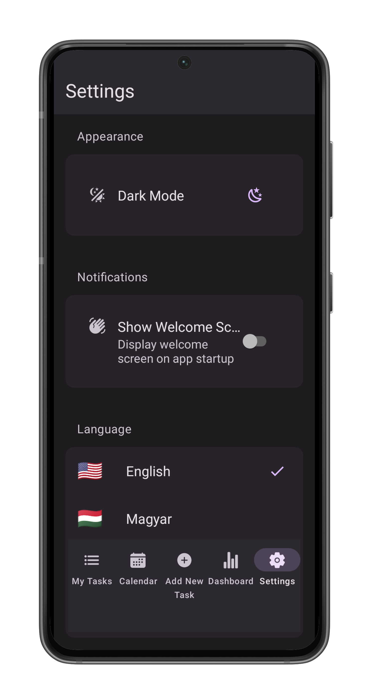

Welcome to Task Manager, your personal productivity companion. The app is designed to help you organize your tasks and expenses efficiently with an intuitive interface and powerful features.Key features:
-This mobile app is standalone and does not require an internet connection to function. 
-It uses the device's local database to store all task data which means you can use it offline and your data is safe.
Completed tasks can be exported to Google Drive as a CSV file.
It is multilingual and supports English, Hungarian, French, and German.
-It can use the device's contacts to link tasks to contacts. 
-User fields can be enterred manually or using voice input from the device's microphone.

Operations:
Search for tasks using the search bar.
Use the bottom navigation bar to switch between screens.
Use the task list screen to view and manage your tasks:tasks can be pending, overdue or completed.
Use the create task screen to create a new task.
Use the task details screen to view and manage a specific task.
Use the task edit screen to edit a specific task.
Use the calendar screen to view pending and overdue tasks by date and manage them.
Use the dashboard screen to view a summary of your tasks and monthly expenses in a beautiful chart.
Use the settings screen to change the app's language and other settings such as light/dark mode.

# User Manual

## Table of Contents
1. [Welcome Screen](#welcome-screen)
2. [Create Task Screen](#create-task-screen)
3. [Task List Screen](#task-list-screen)
4. [Task Details Screen](#task-details-screen)
5. [Edit Task Screen](#edit-task-screen)
6. [Calendar Screen](#calendar-screen)
7. [Dashboard Screen](#dashboard-screen)
8. [Settings Screen](#settings-screen)

---

---

## Welcome Screen

### Overview
The **Welcome Screen** is the first thing you see when launching the application. It provides a quick introduction to the app's key features and capabilities.

### Features
- **Key Features Overview**: A scrolling list of cards highlighting what the app can do:
    - **Organize Your Tasks**: Create and manage tasks with priorities and deadlines.
    - **Contact Integration**: Link tasks to people in your address book.
    - **Voice Input**: Use speech-to-text for hands-free task creation.
    - **Calendar View**: Visualize your schedule.
    - **Multi-Language Support**: Available in English, Hungarian, French, and German.
    - **Google Drive Export**: Backup your completed tasks.

### Actions
- **Get Started**: Tap the large button at the bottom to dismiss the welcome screen and enter the main application.
- **Screen Capture**: A camera icon in the top-right corner allows you to take a screenshot of this view.

*Note: You can disable this screen in the Settings if you prefer to go straight to your tasks.*

## Create Task Screen

### Overview
The **Create Task Screen** allows you to add new tasks to your list, ensuring you never miss an important deadline or activity.

### Accessing the Screen
- Tap the ** "+" Add new task** button located in the center of the bottom navigation bar from any main screen.

### Features & Fields

#### 1. Task Creation
- **Title**: Enter a concise name for your task. This is a required field.
    - *Tip*: Use the **microphone icon** next to the input to dictate the title using your voice.
- **Description** optional: Add detailed information about the task.
    - *Voice Input*: Use the microphone button below the field to dictate long descriptions.
- **Comment** optional: Add any initial comments or notes relevant to the task.
    - *Voice Input*: Use the microphone button below the field to dictate long descriptions.

    Click and hold the microphone icon to start dictating. Release the microphone icon to stop dictating.You can combine voice input with typing.Use which ever method you prefer.

#### 2. Financials, optional
- **Bill Amount**: Toggle the switch if this task involves a payment or expense.
    - Enter the amount in the field provided.
    - The currency is set to your default currency.
    -  the currency dropdown button (showing a symbol like $, €, Ft) to change the billing currency (USD, EUR, GBP, HUF).

#### 3. Priority
- Select a priority level to categorize the urgency of the task. The selected priority is highlighted:
    - **Low** (Green)
    - **Medium** (Blue - Default)
    - **High** (Orange)
    - **Urgent** (Red)

#### 4. Contacts, optional
- **Link Contact**: Tap the **Search Button** to associate a person from your device's contacts with this task.
Enter the name of the contact you want to link to the task. The app will search your device's contacts and display matching results. Select the desired contact to link them to the task.If the contact has an address, it will be displayed below the contact name. You can tap the address to open it in Google Maps.
- **Remove Contact**: If a contact is selected, tap the **Remove** button to unlink them.

#### 5. Scheduling, optional
- **Due Date**: Tap the calendar input to open the calendar and set a deadline.
- **Time**: Once a date is picked, a time field appears. Tap the clock input to set a specific time.
- **Reminders**: Enable the "Reminders" switch to set notifications (requires a Due Date).
    - Select one or more options (e.g. "10 minutes before", "1 hour before", "1 day before") to receive alerts.

### Actions
- **Save**: Tap the solid button at the bottom (e.g., "Create Task") to save the task to your list.
- **Create & Mark Complete**: Tap the outlined button to create the task and immediately mark it as finished.

---

## Task List Screen

### Overview
The **Task List Screen** is the main hub of the application. It displays all your tasks, categorized by their status, and provides quick access to search and management tools.

### Accessing the Screen
- Tap the **"Tasks" (List)** icon on the left side of the bottom navigation bar.
- This is usually the default screen when you open the app.

### Features

#### 1. Filtering Tasks
Use the chips (buttons) at the top of the list to filter tasks:
- **Pending**: Shows tasks that are active and not yet overdue.
- **Overdue**: Critical tasks that have passed their due date.
- **Completed**: A history of all your finished tasks.
- **All**: Displays every task, categorized and sorted by urgency.

#### 2. Search
- Tap the **Magnifying Glass** icon in the top right header to open the search bar.
- Type any part of a task's title or description to instantly filter the list.

#### 3. Task Cards
Each task is displayed as a card containing:
- **Status Icon**: A checkbox icon indicates if the task is complete (green) or pending (square).
- **Title & Description**: The main details of the task. Completed tasks appear crossed out.
- **Priority Label**: A colored tag showing the urgency (Low, Medium, High, Urgent).
- **Dates**: display underneath the description.
    - **Creation Date**: When the task was added.
    - **Due Date**: The deadline, if set. Overdue dates appear in red with an alert icon.

### Actions

#### Viewing Task Details
- **Tap any task card** to open its detailed view, where you can edit, complete, or delete it.

#### Exporting Tasks
*(Only available in the "Completed" filter)*
- Tap the **Cloud Upload** icon in the top right header.
- This generates a CSV file of your completed tasks and uploads it to your Google Drive.
- You will be asked to sign in to your Google account.
- You will receive a link to view the file upon success.

## Task Details Screen

### Overview
The **Task Details Screen** provides a comprehensive view of a specific task, showing all its associated information and allowing for management actions.

### Accessing the Screen
- Tap on any **Task Card** from the **Task List Screen** or **Calendar Screen**.

### Features
- **Header**: Contains the "Back" button, title, and buttons for **Screen Capture** and **Edit** (Pencil icon).
- **Task Information**: Displays the task's Title, Status, and Priority level.
- **Description & Notes**: content of the description and any added comments.
- **Financial Details**: Bill amount and currency (if applicable).
- **Dates**: Created date, Due date, and Completed date.
- **Contact Card**: If a contact is linked, their details are shown here.

### Actions
- **Mark Complete**: Tap the green button to finish the task.
- **Edit Task**: Tap the "Edit Task" button (if pending) or the pencil icon to modify the task.
- **Delete Task**: Tap the red "Delete Task" button to permanently remove the item.

## Edit Task Screen

### Overview
The **Edit Task Screen** allows you to update or correct information for an existing task. It works similarly to the Create Task Screen but comes pre-filled with the task's current data.

### Accessing the Screen
- From the **Task Details Screen**, tap the **Pencil icon** in the top header or the **"Edit Task" button** at the bottom of the details view.

### Features
- **Header**: Contains the "Back" button, title, and a **Screen Capture** (camera icon) button.
- **Pre-filled Fields**: All fields (Title, Description, Priority, Due Date, etc.) are populated with the existing data.
- **Status Indicator**: Shows the current status of the task (e.g., Pending).
- **Modifiable Fields**:
    - **Title & Description**: Edit text or use voice dictation.
    - **Priority**: Change the urgency level.
    - **Dates & Reminders**: Update the deadline or notification settings.
    - **Financials**: Adjust the bill amount or currency.
    - **Contacts**: specific contact can be linked or removed.

### Actions
- **Update Task**: Tap the solid button to save your changes.
- **Update & Mark Complete**: Tap the outlined button to save changes and immediately mark the task as finished.
- **Cancel**: Tap the "Cancel" text button to discard changes and return to the details view.

## Calendar Screen

### Overview
The **Calendar Screen** offers a visual overview of your schedule, allowing you to plan ahead and quickly identify busy days.

### Accessing the Screen
- Tap the **"Calendar"** icon on the bottom navigation bar.

### Features

#### 1. Monthly View
- Swipe left or right to switch between months.
- **Dots** under dates indicate scheduled tasks:
    - **Red Dot**: Indicates overdue tasks or high-priority items.
    - **Blue/Green Dot**: Indicates scheduled or completed tasks.

#### 2. Date Selection
- Tap any date on the calendar to select it. The selected date is highlighted.
- The list below the calendar updates to show tasks for that specific day.

#### 3. Daily Task List
Below the calendar, you will see the "Tasks Due" section:
- **Title**: Shows the currently selected date (e.g., "Monday, February 10, 2026").
- **Content**: Displays a list of:
    - **Overdue Tasks**: Tasks from previous dates that are still pending.
    - **Due Today**: Tasks specifically scheduled for the selected date.
    *Note: Completed tasks are hidden from this view to help you focus on what needs to be done.*

### Actions
- **Open Task**: Tap any task card in the list to view or edit its details.

---

## Dashboard Screen

### Overview
The **Dashboard Screen** provides deep insights into your productivity and financial tracking over time.

### Accessing the Screen
- Tap the **"Dashboard" (Chart)** icon on the bottom navigation bar.

### Features

#### 1. Quick Stats & Alerts
- **Overdue Alert**: If you have missed deadlines, a red banner appears at the top.
- **Statistics Grid**:
    - **Total Tasks**: The all-time count of tasks you've created.
    - **Completed**: Number of finished tasks.
    - **Pending**: Number of active tasks remaining.
    - **Completion Rate**: Your efficiency score as a percentage.

#### 2. Financial Overview
Track expenses related to your tasks (e.g., bills, shopping, project costs).
- **Currency Selector**: Tap the button (e.g., "$ US Dollar") to switch views between currencies.The default currency is your local currency.
- **Total Billing**: Displays the total monthly amount for the selected currency.
- **Monthly Chart**: A bar graph showing your spending trends over recent months.
- **Category Breakdown**: A pie chart visualizing where your money is going.

#### 3. Priority Breakdown
- A list showing how your tasks are distributed across importance levels (Urgent, High, Medium, Low).
- Helps you understand if you are overloaded with urgent tasks.

#### 4. App Info
- Displays the current version of the app and storage method (Local Device).

## Settings Screen

### Overview
The **Settings Screen** allows you to customize the application to your preferences, manage data, and access developer tools.

### Accessing the Screen
- Tap the **"Settings" (Gear)** icon on the right side of the bottom navigation bar.

### Features

#### 1. Appearance
- **Theme**: Toggle between **Light Mode** and **Dark Mode**.
    - *Light Mode*: Best for bright environments.
    - *Dark Mode*: Reduces eye strain in low-light conditions.

#### 2. Notifications & General
- **Show Welcome Screen**: Toggle this switch to enable or disable the introductory slideshow when the app starts.

#### 3. Language
- Use the language switcher to change the application's interface language (e.g., English, Hungarian, German, French).

#### 5. Developer & About
- **Preview Welcome Screen**: Replays the onboarding tutorial.
- **About**: Displays the app version (1.0.0), credits, and copyright information.
    

