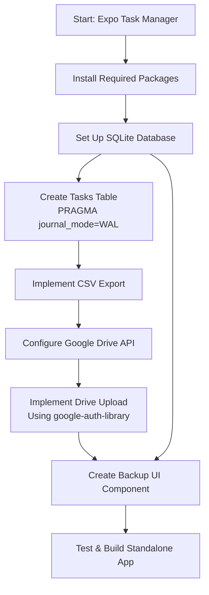
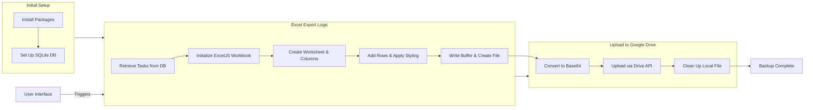

I'll guide you through adding SQLite and Google Drive backup to your Expo React Native Task Manager. First, here is a concise implementation plan:



### 📦 **Dependencies Installation**

First, install the required packages:

```bash
# SQLite for data persistence
npx expo install expo-sqlite

# File system for CSV file handling
npx expo install expo-file-system

# Google APIs for Drive integration
npm install googleapis
```

### 💾 **SQLite Database Setup**

Configure SQLite for your task manager. The `expo-sqlite` package provides access to a database that persists across app restarts. This will serve as your task storage foundation.

```javascript
// database.js
import * as SQLite from 'expo-sqlite';

async function initializeDatabase() {
  const db = await SQLite.openDatabaseAsync('tasks.db');
  
  await db.execAsync(`
    PRAGMA journal_mode = 'wal';
    CREATE TABLE IF NOT EXISTS tasks (
      id INTEGER PRIMARY KEY NOT NULL,
      title TEXT NOT NULL,
      description TEXT,
      due_date TEXT,
      priority INTEGER DEFAULT 1,
      completed BOOLEAN DEFAULT 0,
      created_at DATETIME DEFAULT CURRENT_TIMESTAMP
    );
  `);
  
  return db;
}

export default initializeDatabase;
```

### 📄 **CSV Export Function**

Create a function to export your tasks as CSV. The following implementation uses pure JavaScript without external libraries, generating a CSV string and creating a Blob for download.

```javascript
// csvExport.js
import * as FileSystem from 'expo-file-system';

async function exportTasksToCSV(db) {
  try {
    // Fetch tasks from database
    const allRows = await db.getAllAsync('SELECT * FROM tasks');
    
    // Define CSV headers
    const headers = ['ID', 'Title', 'Description', 'Due Date', 'Priority', 'Completed'];
    
    // Convert data to CSV format
    const csvRows = allRows.map(task => [
      task.id,
      `"${task.title.replace(/"/g, '""')}"`, // Escape quotes
      `"${(task.description || '').replace(/"/g, '""')}"`,
      task.due_date || '',
      task.priority,
      task.completed ? 'Yes' : 'No'
    ]);
    
    const csvContent = [
      headers.join(','),
      ...csvRows.map(row => row.join(','))
    ].join('\n');
    
    // Save to local file
    const csvUri = FileSystem.documentDirectory + `tasks_${Date.now()}.csv`;
    await FileSystem.writeAsStringAsync(csvUri, csvContent, {
      encoding: FileSystem.EncodingType.UTF8
    });
    
    return csvUri;
  } catch (error) {
    console.error('CSV Export Error:', error);
    throw error;
  }
}
```

### ☁️ **Google Drive Integration**

For Google Drive backup, you have two approaches:

| Approach | User Experience | Implementation Complexity |
|----------|----------------|---------------------------|
| **Service Account** | No user login required | Moderate |
| **OAuth 2.0** | User authentication required | More complex |

**Using Service Account (Simpler, no user login):**

```javascript
// driveUpload.js
import { google } from 'googleapis';
import * as FileSystem from 'expo-file-system';

async function uploadToGoogleDrive(fileUri, fileName) {
  // Initialize auth with service account credentials
  const auth = new google.auth.JWT(
    process.env.GOOGLE_SERVICE_ACCOUNT_EMAIL,
    null,
    process.env.GOOGLE_PRIVATE_KEY.replace(/\\n/g, '\n'),
    ['https://www.googleapis.com/auth/drive.file']
  );
  
  const drive = google.drive({ version: 'v3', auth });
  
  // Read file content
  const fileContent = await FileSystem.readAsStringAsync(fileUri, {
    encoding: FileSystem.EncodingType.Base64
  });
  
  // Upload to Drive
  const response = await drive.files.create({
    requestBody: {
      name: fileName,
      mimeType: 'text/csv',
      parents: [process.env.GOOGLE_DRIVE_FOLDER_ID]
    },
    media: {
      mimeType: 'text/csv',
      body: fileContent
    }
  });
  
  return response.data;
}
```

### 🧩 **Complete Backup Component**

Here's a complete React component that integrates everything:

```javascript
// BackupComponent.jsx
import React, { useState } from 'react';
import { View, Button, Alert, ActivityIndicator } from 'react-native';
import initializeDatabase from './database';
import { exportTasksToCSV } from './csvExport';
import { uploadToGoogleDrive } from './driveUpload';

export default function BackupComponent() {
  const [isBackingUp, setIsBackingUp] = useState(false);
  
  const handleBackup = async () => {
    setIsBackingUp(true);
    
    try {
      // 1. Initialize database
      const db = await initializeDatabase();
      
      // 2. Export to CSV
      const csvUri = await exportTasksToCSV(db);
      
      // 3. Upload to Google Drive
      const fileName = `tasks_backup_${new Date().toISOString().split('T')[0]}.csv`;
      await uploadToGoogleDrive(csvUri, fileName);
      
      // 4. Clean up local file
      await FileSystem.deleteAsync(csvUri);
      
      Alert.alert('Success', 'Tasks backed up to Google Drive successfully!');
    } catch (error) {
      Alert.alert('Backup Failed', error.message);
    } finally {
      setIsBackingUp(false);
    }
  };
  
  return (
    <View style={{ padding: 20 }}>
      <Button
        title={isBackingUp ? "Backing Up..." : "Backup to Google Drive"}
        onPress={handleBackup}
        disabled={isBackingUp}
      />
      {isBackingUp && <ActivityIndicator style={{ marginTop: 20 }} />}
    </View>
  );
}
```

### 🔧 **Configuration Requirements**

1. **Expo Configuration** (`app.json`):
```json
{
  "expo": {
    "plugins": [
      ["expo-sqlite", {
        "enableFTS": true,
        "useSQLCipher": false
      }]
    ]
  }
}
```

2. **Google Cloud Setup**:
   - Create a project in [Google Cloud Console](https://console.cloud.google.com/)
   - Enable Google Drive API
   - Create a Service Account and download credentials
   - Share your Drive folder with the service account email

3. **Environment Variables** (use `expo-constants`):
```javascript
// app.config.js
export default {
  expo: {
    // ... other config
    extra: {
      googleServiceAccountEmail: process.env.GOOGLE_SERVICE_ACCOUNT_EMAIL,
      googlePrivateKey: process.env.GOOGLE_PRIVATE_KEY,
      googleDriveFolderId: process.env.GOOGLE_DRIVE_FOLDER_ID
    }
  }
};
```

### 📱 **Standalone App Build**

To create your standalone app:

```bash
# Build for Android
npx expo run:android

# Build for iOS (requires macOS)
npx expo run:ios
```

### ⚠️ **Important Considerations**

1. **Security**: Avoid hardcoding credentials in your app. Use environment variables or secure storage solutions.
2. **CSV Injection Protection**: Sanitize task data to prevent CSV injection attacks.
3. **Error Handling**: Implement retry logic for network failures during Drive upload.
4. **Large Datasets**: For many tasks, consider pagination during export to avoid memory issues.

This implementation gives you a complete backup solution for your Task Manager app. Would you like me to elaborate on any specific part, such as adding user authentication for Google Drive instead of using a service account?


Switching from CSV to Excel is a good move, as Excel files (.xlsx) offer better formatting and are more user-friendly. You can achieve this by replacing the previous CSV export logic with a library designed for creating Excel files directly.

Here is an updated plan to modify your existing task manager app:



### 📦 **Key Code Changes for Excel Export**

You should primarily focus on creating a new `excelExport.js` file to replace the `csvExport.js` from the previous plan.

```javascript
// excelExport.js
import * as FileSystem from 'expo-file-system';
import ExcelJS from 'exceljs';

async function exportTasksToExcel(db) {
  try {
    // 1. Fetch tasks from SQLite database
    const allRows = await db.getAllAsync('SELECT * FROM tasks');
    
    // 2. Create a new Excel workbook
    const workbook = new ExcelJS.Workbook();
    workbook.creator = 'My Task Manager'; // Optional: Set metadata
    workbook.created = new Date();
    
    // 3. Add a worksheet
    const worksheet = workbook.addWorksheet('My Tasks', {
      properties: { tabColor: { argb: 'FFC0000' } } // Optional styling
    });
    
    // 4. Define worksheet columns (headers)
    worksheet.columns = [
      { header: 'ID', key: 'id', width: 10 },
      { header: 'Title', key: 'title', width: 30 },
      { header: 'Description', key: 'description', width: 50 },
      { header: 'Due Date', key: 'due_date', width: 15 },
      { header: 'Priority', key: 'priority', width: 10 },
      { header: 'Completed', key: 'completed', width: 12 },
    ];
    
    // 5. Add the task rows to the worksheet
    allRows.forEach(task => {
      worksheet.addRow({
        id: task.id,
        title: task.title,
        description: task.description || '',
        due_date: task.due_date || '',
        priority: task.priority,
        completed: task.completed ? 'Yes' : 'No'
      });
    });
    
    // 6. Style the header row (make it bold)
    const headerRow = worksheet.getRow(1);
    headerRow.eachCell(cell => {
      cell.font = { bold: true };
    });
    
    // 7. Write the workbook to a buffer and save it as a file
    const buffer = await workbook.xlsx.writeBuffer();
    const excelUri = FileSystem.documentDirectory + `tasks_${Date.now()}.xlsx`;
    
    await FileSystem.writeAsStringAsync(
      excelUri, 
      Buffer.from(buffer).toString('base64'), 
      { encoding: FileSystem.EncodingType.Base64 }
    );
    
    return excelUri;
  } catch (error) {
    console.error('Excel Export Error:', error);
    throw error;
  }
}
```

### 🔄 **Adapt the Google Drive Upload**

The `uploadToGoogleDrive` function needs a minor tweak to correctly handle the Excel file type.

```javascript
// In your driveUpload.js file
async function uploadToGoogleDrive(fileUri, fileName) {
  // ... (authentication logic remains the same as before)
  
  const drive = google.drive({ version: 'v3', auth });
  
  // Read the Excel file content
  const fileContent = await FileSystem.readAsStringAsync(fileUri, {
    encoding: FileSystem.EncodingType.Base64 // Read as base64
  });
  
  // Upload to Drive, specifying the correct MIME type
  const response = await drive.files.create({
    requestBody: {
      name: fileName,
      mimeType: 'application/vnd.openxmlformats-officedocument.spreadsheetml.sheet', // Excel MIME type
      parents: [process.env.GOOGLE_DRIVE_FOLDER_ID]
    },
    media: {
      mimeType: 'application/vnd.openxmlformats-officedocument.spreadsheetml.sheet',
      body: fileContent // base64 content
    }
  });
  
  return response.data;
}
```

### 📝 **Summary of Required Changes**

| File | Change Needed |
| :--- | :--- |
| **`excelExport.js`** | **Create new file** using code above to generate `.xlsx` files. |
| **`driveUpload.js`** | Update the `mimeType` to the correct Excel MIME type. |
| **`BackupComponent.jsx`** | Import and call `exportTasksToExcel` instead of `exportTasksToCSV`. |
| **`package.json`** | Add the new `exceljs` dependency. |

### 💡 **Important Notes for Implementation**

1.  **Installation**: You need to install the `exceljs` library. Run `npm install exceljs` in your project directory.
2.  **Data Handling**: The `exceljs` library gives you extensive control over styling (colors, fonts, borders, number formats). You can apply these styles to rows or individual cells based on priority or status.
3.  **File Sharing**: Once the `.xlsx` file is created locally, you can also use the `expo-sharing` module to let users share the file directly via email or other apps on their device.
4.  **Performance**: For a large number of tasks, consider using the `worksheet.addRows()` method to add all data at once for better performance.

I hope this provides a clear path to implementing Excel exports in your app! If you'd like to see how to add more advanced Excel styling (like coloring rows based on priority), just let me know.